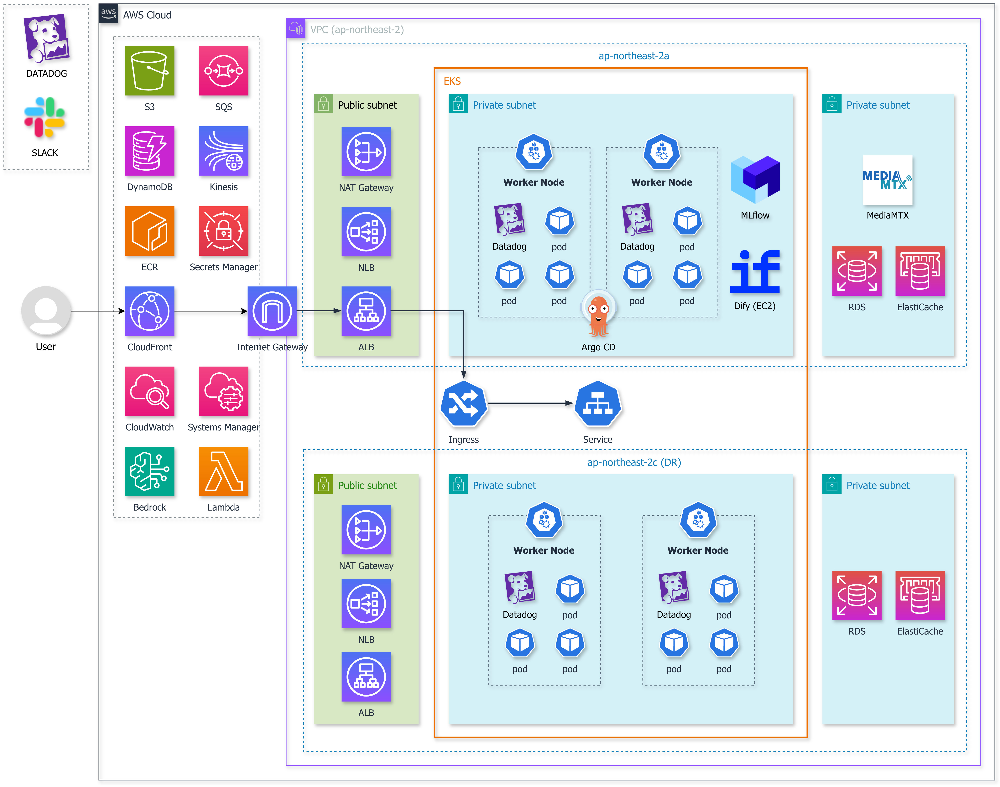
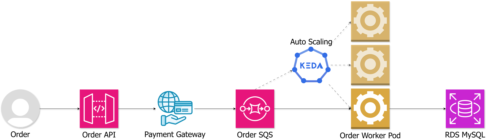
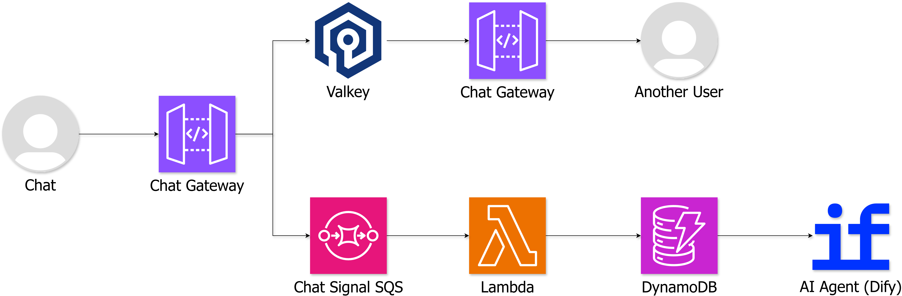
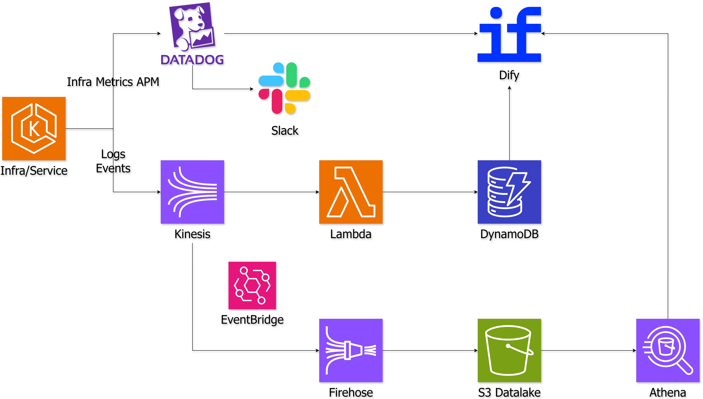
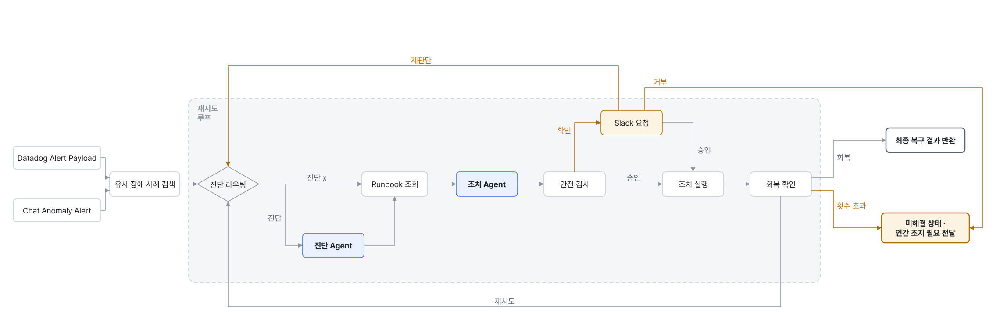

# O2 Live Commerce AIOps

### CJ Olivenetworks AI Cloud Wave 1기 최종 프로젝트
**5인 팀, 3주 진행**

> AWS/EKS 기반 라이브커머스 서비스와, <br>채팅·메트릭에서 장애 신호를 찾아 안전하게 진단·조치·검증하는 AIOps 플랫폼

O2는 라이브 영상, 실시간 채팅, 재고·주문·결제를 운영하는 서비스입니다. 사용자들이 채팅으로 제기한 불편함과 Datadog 모니터 신호를 하나의 Incident로 병합하고, 검증된 장애 이력과 Runbook을 근거로 AI Agent가 대응하도록 설계했습니다.


## 목차

1. [팀 구성](#팀-구성)
2. [해결하려는 문제](#해결하려는-문제)
3. [핵심 기능](#핵심-기능)
4. [전체 아키텍처](#전체-아키텍처)
5. [핵심 서비스 흐름](#핵심-서비스-흐름)
6. [관측 데이터 파이프라인](#관측-데이터-파이프라인)
7. [AIOps 동작 방식](#aiops-동작-방식)
8. [MLflow 기반 모델 비교·선정](#mlflow-기반-모델-비교선정)
9. [장애 대응 시나리오](#장애-대응-시나리오)
10. [실측 지표](#실측-지표)
11. [배포와 운영](#배포와-운영)
12. [저장소 구성](#저장소-구성)
13. [기술 스택](#기술-스택)

## 팀 구성

| 팀원 | 역할 | 담당 |
|---|---|---|
| [@j0chan](https://github.com/j0chan) | PM·인프라 | 프로젝트 관리, AWS·EKS 인프라 구축 |
| [@olavvn](https://github.com/olavvn) | 데이터 파이프라인 | 이벤트 수집·집계·저장 파이프라인 구축 |
| [@SangMun](https://github.com/SangMun) | 서비스·CI/CD | 라이브커머스 서비스와 CI/CD·GitOps 구축 |
| [@taeyoung0524](https://github.com/taeyoung0524) | AI Agent | 이상 탐지·장애 진단 Agent 구축 |
| [@suys65](https://github.com/suys65) | AI Agent | 안전 조치·검증·결과 보고 Agent 구축 |

## 해결하려는 문제

라이브커머스는 방송 시작과 특가 오픈 시점에 트래픽이 한 번에 몰리고, 영상·채팅·주문이 서로 다른 방식으로 확장됩니다. 장애가 발생하면 모니터 임계치보다 사용자 채팅이 먼저 반응할 수 있고, 결제나 데이터 계층 장애는 주문 손실로 바로 이어집니다.

O2는 이 문제를 세 계층으로 나눠 해결합니다.

| 계층 | 해결 방식 |
|---|---|
| 서비스 인프라 | CloudFront 영상 팬아웃, Valkey 채팅 팬아웃, SQS 비동기 주문, HPA·KEDA·Karpenter 확장 |
| 관측·데이터 | 애플리케이션 이벤트와 Datadog 메트릭을 수집하고 Hot·Warm·History 데이터로 분리 |
| AIOps | 채팅·Datadog 신호 병합 → 이력·Runbook 조회 → 진단 → 승인·조치 → 복구 검증 |

## 핵심 기능

- **실시간 서비스 분리:** 영상, 채팅, 주문 경로를 분리해 한 경로의 장애가 전체 방송으로 번지는 범위를 줄입니다.
- **큐시트 기반 사전 워밍:** 예정된 방송 진입 구간 전에 방송별 캐시를 워밍하고, 권한이 허용된 환경에서만 파드를 선확장해 방송 시작 시 데이터 계층 집중 부하를 줄입니다.
- **복합 신호 Incident:** 사용자의 채팅 기반 체감 장애와 Datadog 알림을 공통 계약으로 정규화해 하나의 Incident로 병합합니다.
- **근거 기반 진단:** 현재 Hot/Warm 지표, 검증된 과거 Incident, 실행 가능한 Runbook을 함께 AI Agent 입력으로 사용합니다.
- **통제된 자동 조치:** 위험도, 사전 조건, 실행 권한, 운영자 승인, 최대 반복 횟수로 자동화 범위를 제한합니다.
- **폐쇄 루프 검증:** 조치 성공 응답만 보지 않고 안정화 대기 후 동일 지표를 다시 측정해 `RESOLVED` 또는 사람 인계를 결정합니다.
- **GitOps 배포:** 애플리케이션 빌드와 Kubernetes 선언 상태를 분리하고 ECR → 배포 저장소 → Argo CD로 변경 이력을 남깁니다.

## 전체 아키텍처



| 영역 | 주요 구성 | 역할 |
|---|---|---|
| Edge | CloudFront, ALB, NLB | 정적 자산·HLS 배포, HTTP/WebSocket·RTMP 진입 |
| Compute | EKS, EC2 Dify, Lambda | 라이브 서비스, 이벤트 처리, Incident·Agent 실행 |
| Data | RDS MySQL, Valkey, SQS, DynamoDB, S3 | 주문 원본, 캐시·Pub/Sub, 비동기 버퍼, 상태·이력 저장 |
| Observability | Datadog, CloudWatch | 메트릭·로그·APM 수집과 장애 신호 생성 |
| AI | Dify, Amazon Bedrock, S3 Vectors | 진단·조치 워크플로, LLM 추론, 유사 장애 검색 |
| Delivery | GitHub Actions, ECR, Argo CD | 검증, 이미지 배포, 선언 상태 동기화 |

## 핵심 서비스 흐름

### 1. 라이브 영상


MediaMTX는 RTMP를 HLS로 리패키징하고, 대규모 시청자 팬아웃은 CloudFront가 담당합니다. 영상 트래픽을 애플리케이션 API 부하와 분리해 EKS 서비스의 장애 반경을 제한합니다.


### 2. 주문·결제


결제 승인 전에는 재고 예약과 멱등성을 보장하고, 승인된 주문만 SQS로 넘깁니다. Order Worker는 큐 적체량에 따라 KEDA가 확장하며, 소비자 장애가 API 요청을 장시간 붙잡지 않게 합니다.

### 3. 채팅 팬아웃과 장애 신호 분리

실시간 전송은 Valkey Pub/Sub, 장애 분석은 내구성 있는 SQS 경로를 사용합니다. 분석 파이프라인이 느려지거나 실패해도 시청자 채팅 팬아웃은 계속 동작합니다. 분석 입력에는 채팅 원문 대신 메시지 수, 고유 사용자 수, 시간 분포 같은 비식별 특징만 사용합니다.


## 관측 데이터 파이프라인




[`o2-sdk-for-event`](https://github.com/CJ-Only-One/o2-sdk-for-event)는 서비스가 발행하는 이벤트에 `event_id`, `trace_id`, 서비스 버전, 비식별 사용자 키를 자동으로 추가합니다. 로컬 큐와 배치 전송을 사용하므로 관측 경로 장애가 주문·채팅 요청을 막지 않습니다.

데이터는 목적별로 분리합니다.

| 데이터 | 용도 | 저장소 |
|---|---|---|
| Hot | 장애 직전의 최신 메트릭·로그 | Datadog |
| Warm | 최근 구간 집계와 Agent 판단 컨텍스트 | DynamoDB |
| History | 장기 이벤트, Incident 결과, 유사 장애 검색 | S3, S3 Vectors |
| Runbook | 승인된 조치, 조건, 검증·롤백 기준 | DynamoDB |

## AIOps 동작 방식



```text
Chat Candidate / Datadog Alert
  → Source Adapter
  → Incident Correlator
  → Agent Worker
  → 현재 지표 + 검증된 History + Runbook 조회
  → Dify / Bedrock 진단
  → Guardrail + Slack 승인
  → 제한 조치
  → 안정화 대기 + 동일 지표 검증
  → 복구 / 재진단 / 원복 / 사람 인계
```

### Agent 책임 분리

| 단계 | 책임 |
|---|---|
| Source Adapter | Chat·Datadog의 서로 다른 입력을 `agent.trigger.v1` 계약으로 정규화 |
| Incident Correlator | 환경·서비스·증상·시간 창을 기준으로 신호 병합, revision·멱등성 관리 |
| Agent Worker | 현재 데이터와 검증된 이력을 준비하고 Dify를 호출 |
| Diagnosis Agent | RCA 후보, 근거, 신뢰도 산출 |
| Runbook Lookup | RCA와 일치하며 `active`인 조치만 반환 |
| Guardrail | 위험도·권한·사전 조건·반복 횟수 평가, 필요 시 Slack 승인 요청 |
| Action Handler | 허용된 파라미터 범위에서 가역적 조치 실행 |
| Verification | 고정된 SLO·회복 지표로 성공 판정, 실패 시 원복·재진단·인계 |

Dify가 Datadog, DynamoDB, S3 Vectors를 직접 탐색하지 않습니다. Worker가 필요한 데이터만 선별해 전달하므로 입력 계약, 개인정보 제외, 토큰 상한과 실패 처리를 코드에서 통제할 수 있습니다.

### 안전 경계

- 채팅 원문과 사용자 식별자를 Agent 입력·임베딩에 저장하지 않습니다.
- History의 존재와 자동 실행 권한을 분리합니다. `verified=true`인 사례도 근거일 뿐 실행 허가는 아닙니다.
- Runbook은 `case → draft → 별도 검증 → 운영자 승인 → active` 생명주기를 따릅니다.
- 고위험 조치는 Slack 승인이 없으면 실행하지 않고, 거부·시간 초과 시 반복을 종료합니다.
- Queue, DLQ, Incident revision, 실행 ledger로 중복 호출과 메시지 손실을 확인합니다.
- HTTP 200이 아니라 Dify 상태, 조치 결과, 안정화 후 지표, 원복 상태까지 확인해야 완료입니다.

## MLflow 기반 모델 비교·선정

Amazon Bedrock의 Claude Opus 5, Sonnet 5, Haiku 4.5를 실제 O2 로그와 Runbook으로 비교하고, 모든 결과를 MLflow에 기록하고 비교했습니다.

### 실험 설계

| 평가 축 | 방법 | MLflow runs |
|---|---|---:|
| 장문 컨텍스트 | 10개 로그 소스 × 3개 프롬프트 × 모델별 컨텍스트 길이에서 토큰·비용·진단 결과 기록 | 413 |
| Tool 호출 | `get_metrics`, `get_logs`, `lookup_runbook` 멀티턴 호출의 인자 정확성 측정 | 441 |
| 위험도 판정 | 실제 Runbook 조치의 L1·L2·L3 라벨과 모델 판정 비교 | 359 |
| 진단 품질 | 동일 로그·프롬프트 셀의 두 출력을 Opus 5가 pairwise 평가 | 123 |
| **합계** | MLflow에 완료 상태로 기록된 실행 | **1,336** |

MLflow에 기록된 모델 호출 비용은 세금 포함 **$660.47**입니다. 이는 모델 비교 호출 비용이며 기존 EKS, RDS, Valkey, MLflow 호스트 같은 상시 인프라 비용은 포함하지 않습니다.

### 비교 결과

| 지표 | Haiku 4.5 | Sonnet 5 | Opus 5 | 해석 |
|---|---:|---:|---:|---|
| Pairwise 품질 비교 | 0 | 24 | **99** | Opus > Sonnet > Haiku|
| 위험도 라벨 일치 | **55.0%** (66/120) | 49.2% (59/120) | 34.5% (41/119) | 전체 46.2%로 자동 Guardrail에 사용하기 부족 |
| Tool 인자 오류 | 0 | 0 | 0 | 전체 4,006회 Tool 호출에서 잘못된 인자 0회 |
| 100K 목표 로그 평균 비용 | **$0.1061** | $0.2897 | $0.8031 | 각각 44·47·48 runs 평균, 출력 토큰 포함 |
| 100K 목표 로그 평균 입력 토큰 | 88,450 | 112,349 | 112,359 | 모델별 토크나이저 차이로 실제 토큰 수가 다름 |

Pairwise 평가는 Opus 5가 심사했으므로 자기 모델 선호 편향을 배제하지 못합니다. 위험도 실험도 `action_id`만 제공한 제한된 조건입니다. 따라서 단일 점수로 모델을 확정하지 않고 품질, 비용, 안전 책임을 분리했습니다.

### 선정안과 적용 상태

| 역할 | 선정 | 근거 | 상태 |
|---|---|---|---|
| 기본 장애 진단 | **Sonnet 5** | Haiku 대비 pairwise 24/24 승리, Opus보다 100K 목표 로그 평균 비용 64% 절감 | 적용 전 |
| 복합·고위험 RCA 재진단 | **Opus 5** | pairwise 99승으로 진단 품질 최상위 | 적용 전 |
| 요약·형식화·저비용 처리 | **Haiku 4.5** | 100K 목표 로그 평균 비용 최저 | 현재 Dify 진단 노드에 적용 |
| 위험도·실행 허가 | **LLM 미사용** | 세 모델 모두 라벨 일치율이 운영 Guardrail 기준에 미달 | Runbook catalog·결정론적 규칙 사용 |

현재 게시된 Dify graph는 Haiku 4.5 단일 모델입니다. Sonnet 기본 진단과 Opus 재진단 라우팅은 MLflow 실험에서 도출한 선정안이며, Dify graph 반영과 동일 조건 E2E를 완료하기 전까지 운영 적용으로 표기하지 않습니다.

## 장애 대응 시나리오

| 시나리오 | 장애 | 대응 흐름 | 현재 검증 범위 |
|---|---|---|---|
| S1 | 채팅 팬아웃 급증 | 방송 단위 총량 제한 → 전파 지연·차단률 검증 → 해제 | 주입·제어면·한계 실측 완료, 전체 자동 조치 E2E 보완 중 |
| S2 | 특정 API 파드 지연 | 파드 증설 → 검증 실패 → 파드별 재진단 → Canary 격리·원복 | Canary와 수동 조치 효과 실측 완료, 자동 재진단·원복 E2E 보완 중 |
| S3 | 외부 PG 지연·실패 | Chat 선감지 + Datadog 후속 신호 → PG 장애 진단 → PG-A에서 PG-B 전환 | PG 주입·전환·Runbook 증거 검증 완료, 복합 신호부터 최종 복구까지 E2E 보완 중 |

완료된 기반 기능과 시나리오 전체 자동 복구를 구분합니다. 현재 프로젝트는 서비스·관측·Incident·Agent 기반을 실제 환경에서 검증했지만, S1-S3의 모든 자동 조치가 운영 수준으로 완료된 상태는 아닙니다.

## 실측 지표


| 근거 | 검증 항목 | 조건 | 결과 |
|---|---|---|---|
| M-003 | 알림 버스트 무손실 처리 | Function URL 동시 알림 30건, Worker 최대 동시 실행 5 | HTTP 30/30, 처리 30/30, 오류 0, DLQ 0 |
| M-009 | API 읽기 경로 | API 1 Pod·Uvicorn 1 Worker, 외부 k6 | 300 RPS에서 p95 314ms·p99 573ms·실패 0.04%; 400 RPS에서 p95 1,352ms로 기준 초과 |
| M-010 | 채팅 팬아웃 | Chat Gateway 2 Pod, 6,000 connections × 20 msg/s | 120,000 items/s에서 서버 p95 576ms·파드당 메모리 241Mi로 안정; 160,000 items/s에서 384Mi limit 도달 후 OOMKill |
| M-020 | 복합 신호 병합 | 실제 WebSocket Chat + Datadog Monitor | 동일 Incident revision 2·sources 2로 병합, Dify 정확히 1회 `succeeded` |
| M-021 | Chat-to-History E2E | WebSocket → Candidate → Incident → Bedrock embedding → Dify → S3/S3 Vectors | Worker 8,200.75ms·attempt 1·96MB, 이력 원본·Vector 저장과 합성 데이터 정리 확인 |
| M-022 | AZ 장애 복구 | RDS failover, Valkey failover, EKS node drain | 애플리케이션 중단 RDS 15초, Valkey 37초, 노드 drain 1초 |
| MLflow | 모델 비교 | 장문·Tool·위험도·pairwise 4개 축 | 1,336 runs, Tool 인자 오류 0/4,006회, 추적 호출 비용 $660.47 |

측정값은 인스턴스, Pod 수, 부하 생성 위치, 집계 창이 바뀌면 다시 측정합니다. 특히 클라이언트 k6 지연과 서버측 지연을 구분하고, 미측정 값은 목표치로 표시합니다.

## 배포와 운영

```text
O2-live-ai-ops
  → GitHub Actions verify
  → Image build + Trivy scan
  → Amazon ECR
  → O2-live-deploy image tag update
  → Argo CD sync
  → Amazon EKS
```

- 애플리케이션 CI는 EKS를 직접 수정하지 않습니다.
- 이미지 태그는 CI만 갱신하고, 리소스·Probe·오토스케일링 정책은 배포 저장소에서 리뷰합니다.
- Terraform CI는 `fmt`·`validate`만 수행하며, `plan`·`apply`는 대상과 destroy 수를 확인한 뒤 실행합니다.
- GitHub OIDC, EKS Pod Identity, 서비스별 IAM/RBAC으로 장기 액세스 키와 과도한 권한을 피합니다.
- Secrets Manager와 External Secrets를 사용해 비밀값을 코드·Terraform state·매니페스트에서 분리합니다.
- 배포 롤백은 배포 저장소의 커밋을 `git revert`해 Argo CD가 이전 선언 상태를 복원하게 합니다.

## 저장소 구성

통합 프로젝트는 책임이 다른 세 코드베이스로 구성됩니다.

| 경로 | 책임 | 주요 내용 |
|---|---|---|
| [`O2-live-ai-ops`](https://github.com/CJ-Only-One/O2-live-ai-ops) | 애플리케이션·인프라·AIOps | 서비스 코드, Terraform, CI, 데이터·Incident·Agent 파이프라인, 부하 테스트, 설계·실측 문서 |
| [`O2-live-deploy`](https://github.com/CJ-Only-One/O2-live-deploy) | Kubernetes 선언 상태 | Argo CD가 감시하는 Deployment, Service, Ingress, KEDA 매니페스트 |
| [`o2-sdk-for-event`](https://github.com/CJ-Only-One/o2-sdk-for-event) | 이벤트 계약 | Python SDK, 이벤트 스키마, 비동기 전송, 프레임워크 미들웨어, 테스트 |

```text
.
├── O2-live-ai-ops/       # Application, Terraform, CI, AIOps
├── O2-live-deploy/       # GitOps manifests
├── o2-sdk-for-event/     # Business event SDK
├── docs/images/          # README architecture assets
└── README.md
```

## 기술 스택

| 구분 | 기술 |
|---|---|
| Cloud | AWS EKS, EC2, Lambda, CloudFront, RDS, ElastiCache, SQS, Kinesis, Firehose, S3, DynamoDB, Glue |
| Application | Python, FastAPI, Node.js, WebSocket, MediaMTX |
| AI·Data | Dify, Amazon Bedrock, S3 Vectors, Athena |
| Observability | Datadog, CloudWatch, 구조화 로그·메트릭·APM |
| IaC·Delivery | Terraform, GitHub Actions, ECR, Argo CD, KEDA, Karpenter |
| Validation | pytest, Node test runner, k6, kubeconform, Trivy, gitleaks |
